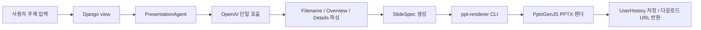

<a id="top"></a>

# SlideArchitect - AI 기반 PPT 생성 웹앱

<div align="center">


**주제 입력부터 편집 가능한 PPTX 다운로드까지 한 번에 이어주는 발표자료 생성 서비스**

[생성 파이프라인](./docs/presentation-agent.md) | [배포 문서](./docs/deploy-lightsail.md) | [이슈 리포트](https://github.com/juwonparkme/ai_ppt/issues)

</div>

---

## 📋 목차

- [소개](#-소개)
- [주요 기능](#-주요-기능)
- [기술 스택](#-기술-스택)
- [시작하기](#-시작하기)
  - [필수 요구사항](#필수-요구사항)
  - [설치](#설치)
  - [환경 변수 설정](#환경-변수-설정)
  - [데이터베이스 설정](#데이터베이스-설정)
  - [실행](#실행)
- [배포](#-배포)
- [프로젝트 구조](#-프로젝트-구조)
- [주요 기능 상세](#-주요-기능-상세)
- [트러블슈팅](#-트러블슈팅)
- [라이선스](#-라이선스)
- [문의](#-문의)

---

## 🎯 소개

**SlideArchitect**는 사용자가 입력한 발표 주제를 OpenAI API로 구조화하고, Django 웹앱과 TypeScript 기반 `ppt-renderer`를 거쳐 실제 `.pptx` 파일로 렌더링하는 AI 발표자료 생성 서비스입니다.

### 핵심 가치

- **빠른 초안 생성**: 주제 한 줄로 파일명, 개요, 상세 슬라이드 내용을 생성
- **렌더 계약 분리**: Django와 Node 렌더러 사이를 `SlideSpec` JSON 계약으로 고정
- **편집 가능한 결과물**: 웹 에디터에서 슬라이드 텍스트를 수정한 뒤 다시 PPTX로 출력
- **사용자별 기록 관리**: 생성 이력, 다운로드 경로, 커스텀 템플릿을 사용자 계정 기준으로 관리
- **운영 가능한 배포 흐름**: Docker Compose/Lightsail 배포와 self-hosted runner 기반 systemd 배포 문서 제공

---

## ✨ 주요 기능

### 1. AI 발표자료 생성

- OpenAI Chat Completions API 기반 발표자료 초안 생성
- `#Filename:`, `#Overview:`, `#Details:` 섹션 파싱
- `SlideSpec`으로 제목, 목차, 본문, 요약 슬라이드 구조화
- 기본 템플릿 `modern-a`, `modern-b` 지원

### 2. PPTX 렌더링

- Node.js/TypeScript 렌더러가 `spec.json`을 입력으로 사용
- PptxGenJS 기반 `.pptx` 파일 생성
- 렌더 결과 JSON을 Django가 파싱해 다운로드 URL 생성
- 렌더 산출물은 `PPT_RENDER_OUTPUT_DIR` 아래 로컬 파일로 저장

### 3. 웹 편집 및 미리보기

- 생성 결과 화면에서 슬라이드 제목, 부제, 불릿 편집
- 슬라이드 추가, 삭제, 재정렬용 클라이언트 스크립트 구성
- 템플릿별 정적 에셋을 Django static 경로로 연결
- 편집된 payload를 다시 `SlideSpec`으로 정규화

### 4. 사용자 계정과 히스토리

- Django 기본 인증 기반 회원가입, 로그인, 로그아웃
- 프로필 이미지와 닉네임 관리
- 사용자별 생성 이력 `UserHistory` 저장
- 사용자별 커스텀 템플릿 `UserTemplate` 업로드

### 5. 배포와 운영

- Dockerfile과 `docker-compose.lightsail.yml` 제공
- Nginx reverse proxy, certbot 갱신 컨테이너 구성
- 선택형 Elasticsearch/Kibana/Filebeat 모니터링 compose 제공
- GitHub Actions CI와 조건부 self-hosted production deploy 구성

---

## 🛠 기술 스택

### Backend

- **Django 5.1.6** - 웹 프레임워크, 인증, 세션, ORM
- **Python 3.12+** - Docker 런타임 기준. CI는 Python 3.13에서 검증
- **OpenAI Python SDK 1.63.2** - 발표자료 생성 요청
- **SQLite** - 기본 로컬 데이터베이스
- **Gunicorn 23.0.0** - 운영 WSGI 서버

### Frontend

- **Django Templates** - 서버 렌더링 화면
- **HTML/CSS** - 랜딩, 로그인, 프로필, 프롬프트, 결과 화면
- **Vanilla JavaScript** - 결과 편집, 템플릿 미리보기, 로그아웃 beacon 처리

### Renderer

- **Node.js 20** - CI와 운영 렌더러 기준
- **TypeScript 5.8.2** - 렌더러 타입 시스템
- **PptxGenJS 3.12.0** - PPTX 파일 생성
- **Zod 3.24.2** - 렌더 입력 검증
- **tsx 4.19.3** - TypeScript CLI 실행

### 배포 및 인프라

- **Docker / Docker Compose** - Lightsail 컨테이너 배포
- **Nginx 1.27 Alpine** - reverse proxy와 정적/미디어 파일 서빙
- **certbot** - Let's Encrypt 인증서 발급/갱신
- **systemd** - self-hosted runner 배포 경로의 서비스 재시작
- **GitHub Actions** - Django check/test, renderer typecheck, 조건부 production deploy

---

## 🚀 시작하기

### 필수 요구사항

- Python 3.12 이상
- Node.js 20 이상
- npm
- OpenAI API 키
- macOS/Linux shell 환경

### 설치

1. **저장소 클론**

```bash
git clone https://github.com/juwonparkme/ai_ppt.git
cd ai_ppt
```

2. **Python 가상환경 생성 및 의존성 설치**

```bash
python3 -m venv .venv
source .venv/bin/activate
pip install -r requirements.txt
```

3. **렌더러 의존성 설치**

```bash
npm --prefix ppt-renderer install
```

### 환경 변수 설정

루트에 `.env` 파일을 생성합니다. `.env.example`을 복사한 뒤 운영 값은 반드시 교체하세요.

```bash
cp .env.example .env
```

최소 실행에 필요한 값:

```env
DJANGO_SECRET_KEY=replace-with-local-secret
DJANGO_DEBUG=true
DJANGO_ALLOWED_HOSTS=127.0.0.1,localhost
DJANGO_CSRF_TRUSTED_ORIGINS=

OPENAI_API_KEY=sk-your-openai-api-key
OPENAI_PRESENTATION_MODEL=your-openai-model
PPT_RENDER_BACKEND=pptxgenjs
PPT_RENDERER_DIR=ppt-renderer
PPT_RENDER_OUTPUT_DIR=tmp/rendered-presentations
USER_TEMPLATE_STORAGE_DIR=tmp/user-templates
```

SMTP 메일 발송을 쓰려면 아래 값도 실제 계정으로 설정합니다.

```env
EMAIL_HOST=smtp.gmail.com
EMAIL_PORT=587
EMAIL_USE_TLS=true
EMAIL_HOST_USER=your-email@example.com
EMAIL_HOST_PASSWORD=your-app-password
```

### 데이터베이스 설정

기본 데이터베이스는 SQLite입니다. 별도 DB 서버 없이 마이그레이션만 실행하면 됩니다.

```bash
python manage.py migrate
python manage.py createsuperuser
```

### 실행

1. **Django 개발 서버 시작**

```bash
python manage.py runserver
```

2. **브라우저 접속**

```text
http://127.0.0.1:8000
```

3. **관리자 페이지 접속**

```text
http://127.0.0.1:8000/admin
```

### 검증 명령

```bash
python manage.py check
python manage.py test
npm --prefix ppt-renderer run typecheck
```

렌더러만 직접 실행할 때:

```bash
npm --prefix ppt-renderer run render -- --input /path/to/spec.json --output /path/to/output.pptx
```

---

## 📦 배포

이 저장소에는 두 가지 배포 경로가 있습니다.

### 1. Lightsail Docker Compose 배포

관련 파일:

- `Dockerfile`
- `docker-compose.lightsail.yml`
- `deploy/lightsail/deploy.sh`
- `deploy/lightsail/app.env.example`
- `docs/deploy-lightsail.md`

기본 흐름:

```bash
cp deploy/lightsail/app.env.example deploy/lightsail/app.env
$EDITOR deploy/lightsail/app.env
./deploy/lightsail/deploy.sh
```

구성:

- `app`: Django/Gunicorn 앱, `/data` 볼륨에 DB/미디어/렌더 결과 저장
- `web`: Nginx reverse proxy, 80/443 포트 공개
- `certbot`: 12시간 주기 인증서 갱신
- `monitoring`: `ENABLE_ELASTIC_MONITORING=true`일 때 Elasticsearch/Kibana/Filebeat 추가

### 2. GitHub Actions + systemd 배포

관련 파일:

- `.github/workflows/ci-cd.yml`
- `deploy/systemd/remote-deploy.sh`
- `docs/systemd-nginx-ci-cd.md`

CI는 PR, `main` push, 수동 실행에서 동작합니다.

```text
checkout
-> Python 3.13 / Node 20 설치
-> pip install -r requirements.txt
-> npm --prefix ppt-renderer ci
-> python manage.py check
-> python manage.py test
-> npm --prefix ppt-renderer run typecheck
```

production deploy는 아래 조건을 모두 만족할 때만 실행됩니다.

- 이벤트가 pull request가 아님
- 브랜치가 `main`
- repository variable `AIPPT_DEPLOY_ENABLED`가 `true`
- runner label이 `self-hosted`, `ai-ppt`, `production`

배포 스크립트는 서버에서 `git pull --ff-only`, 의존성 설치, migrate, collectstatic, Django check, systemd restart, `/healthz/` 확인을 수행합니다.

---

## 📁 프로젝트 구조

```text
ai_ppt/
├── blog/                         # Django 앱
│   ├── prompts/                  # OpenAI 프롬프트 파일
│   ├── services/                 # 생성, 편집 payload, PPT 렌더 서비스
│   ├── static/                   # CSS/JS/이미지
│   ├── templates/                # 앱 화면 템플릿
│   ├── tests/                    # Django 회귀 테스트
│   ├── models.py                 # CustomUser, UserHistory, UserTemplate
│   ├── slide_spec.py             # Django와 renderer 사이 JSON 계약
│   └── views.py                  # 웹 요청 처리
├── new3/                         # Django project settings/urls/wsgi
├── ppt-renderer/                 # TypeScript + PptxGenJS 렌더러
│   ├── assets/                   # 템플릿별 렌더 에셋
│   └── src/                      # CLI, spec 검증, 템플릿 구현
├── deploy/
│   ├── lightsail/                # Docker/Nginx/certbot 배포 파일
│   └── systemd/                  # self-hosted runner 배포 스크립트
├── docs/                         # 설계, 배포, 운영 문서
├── templates/                    # 공통 Django 템플릿
├── Dockerfile
├── docker-compose.lightsail.yml
├── docker-compose.monitoring.yml
├── manage.py
├── requirements.txt
└── README.md
```

---

## 🎨 주요 기능 상세

### 1. 생성 파이프라인



- **입력**: 사용자가 입력한 주제와 선택한 템플릿
- **생성**: `blog/services/presentation_agent.py`
- **계약**: `blog/slide_spec.py`의 `PresentationSpec`, `SlideSpecItem`
- **렌더**: `blog/services/ppt_renderer.py`가 `npm run render` 호출
- **출력**: `spec.json`, `.pptx`, 생성 이력 DB 레코드

### 2. 템플릿 처리

- 내장 템플릿: `modern-a`, `modern-b`
- 웹 카드 ID는 `resolve_pptx_template()`에서 렌더러 키로 변환
- 사용자 업로드 템플릿은 `USER_TEMPLATE_STORAGE_DIR/<user_id>/` 아래 저장
- 업로드 파일 미리보기는 macOS `qlmanage`가 있을 때 PNG로 생성

### 3. 데이터 저장과 보안 경계

- 계정 정보는 Django `CustomUser` 모델에 저장
- 생성 이력은 `UserHistory`가 `user` FK로 소유자와 연결
- 프로필/히스토리/템플릿 화면은 로그인 필요
- 다운로드 토큰은 로컬 파일 경로를 인코딩하고, 요청 경로가 `PPT_RENDER_OUTPUT_DIR` 아래인지 확인
- 현재 저장소 기준 저장소는 SQLite와 로컬 파일 시스템 중심입니다. 별도 managed object storage나 at-rest encryption 설정은 코드에 포함되어 있지 않습니다.

### 4. 문서 인덱스

| 문서 | 내용 |
| --- | --- |
| [docs/presentation-agent.md](./docs/presentation-agent.md) | OpenAI 생성 파이프라인과 파일 경계 |
| [docs/slide-spec.md](./docs/slide-spec.md) | Django와 renderer 사이 `SlideSpec` 계약 |
| [docs/web-ui.md](./docs/web-ui.md) | 웹 UI 구조 |
| [docs/deploy-lightsail.md](./docs/deploy-lightsail.md) | Lightsail Docker 배포 |
| [docs/systemd-nginx-ci-cd.md](./docs/systemd-nginx-ci-cd.md) | systemd/Nginx/GitHub Actions 배포 |
| [docs/docker-beginner-checklist.md](./docs/docker-beginner-checklist.md) | Docker 배포 체크리스트 |
| [docs/lightsail-nginx-troubleshooting.md](./docs/lightsail-nginx-troubleshooting.md) | Lightsail/Nginx 문제 해결 기록 |
| [docs/elastic-monitoring.md](./docs/elastic-monitoring.md) | 선택형 Elastic 모니터링 구성 |

---

## 🔧 트러블슈팅

### `OPENAI_API_KEY`가 없다는 오류

**증상**: PPT 생성 시 OpenAI API 키가 없다는 설정 오류가 발생합니다.

**해결 방법**:

1. 루트 `.env` 파일을 확인합니다.
2. `OPENAI_API_KEY=sk-...` 값을 설정합니다.
3. 서버를 재시작합니다.

### 렌더러가 실행되지 않음

**증상**: `npm run render` 호출에서 실패하거나 `ppt-renderer` 의존성을 찾지 못합니다.

**해결 방법**:

1. 렌더러 의존성을 설치합니다.

```bash
npm --prefix ppt-renderer install
```

2. `PPT_RENDERER_DIR`가 실제 렌더러 경로를 가리키는지 확인합니다.

```env
PPT_RENDERER_DIR=ppt-renderer
```

3. 타입 체크로 기본 빌드 상태를 확인합니다.

```bash
npm --prefix ppt-renderer run typecheck
```

### 생성된 PPTX 파일을 찾을 수 없음

**증상**: 히스토리에서 다운로드 링크가 보이지 않거나 파일 없음 오류가 납니다.

**해결 방법**:

1. `PPT_RENDER_OUTPUT_DIR` 값이 변경되었는지 확인합니다.
2. 해당 디렉터리 아래에 렌더 결과 `.pptx`가 있는지 확인합니다.
3. 운영 Docker 환경이면 `/data/rendered-presentations` 볼륨이 유지되는지 확인합니다.

### Lightsail에서 HTTPS가 바로 켜지지 않음

**증상**: 첫 배포 직후 HTTP 설정으로 Nginx가 뜹니다.

**해결 방법**:

1. `deploy/lightsail/app.env`의 `NGINX_SERVER_NAME`, `LETSENCRYPT_EMAIL` 값을 확인합니다.
2. DNS가 서버 IP를 가리키는지 확인합니다.
3. `./deploy/lightsail/deploy.sh`를 다시 실행해 인증서 발급 후 HTTPS config로 재생성합니다.

---

## 📄 라이선스

현재 저장소에는 별도 `LICENSE` 파일이 없습니다. 사용, 배포, 재사용 권한은 저장소 소유자에게 확인해야 합니다.

---

## 📞 문의

- **Owner**: Juwon Park
- **GitHub**: [@juwonparkme](https://github.com/juwonparkme)
- **이메일**: [hello@juwonpark.me](mailto:hello@juwonpark.me)
- **이슈**: [github.com/juwonparkme/ai_ppt/issues](https://github.com/juwonparkme/ai_ppt/issues)

<div align="center">

**Made by Juwon Park**

[⬆ 맨 위로 이동](#top)

</div>
